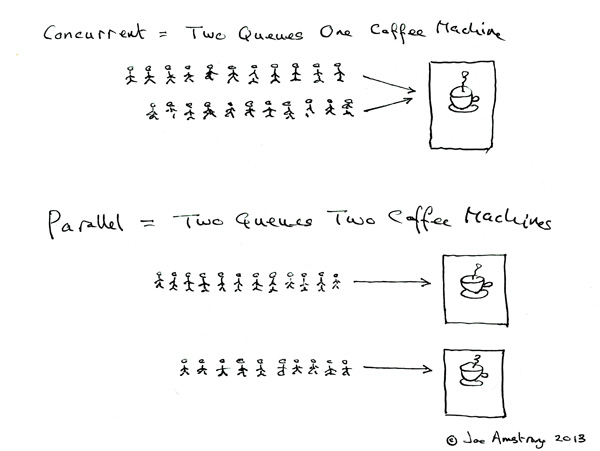

# Program & Process & Thread

## Program

컴퓨터에서 어떤 작업을 위해 실행할 수 있는 **정적인 상태**의 파일을 프로그램이라고 한다.

## Process
CPU에 의해 처리되는 시스템 프로그램, 즉 실행 중인 프로그램(**동적인 상태**의 프로그램)을 프로세스라고 한다.
 
Process가 실행되면 프로그램은 메모리에 올라가게 된다.
 
Process는 Job 또는 Task라고도 불린다.
 
Process는 독립적이면 각각의 process는 Code, Data, Heap, Stack 구조로 이루어져 있다.
 
* Code : 프로그램의 코드가 저장되는 곳으로, CPU는 Code region에서 명령어를 가져가서 처리한다.
* Data : static 변수, 전역 변수가 저장되는 곳이다.
* Heap : 동적 메모리 영역이다.
* Stack : 지역 변수, 매개 변수, 반환 값 등 일시적인 데이터들이 저장되는 영역이다.

 
하나의 process는 한 번에 하나의 thread를 처리할 수 있다.

## Thread
독립적으로 수행되는 순차적인 제어 흐름을 thread라고 한다.
 
Thread는 process 에서 실행 제어만 분리한 **실행 단위**로 한 개의 프로세스는 여러 개의 스레드를 가질 수 있다.

### CPU의 Core
CPU는 중앙처리 장치(Central Processing Unit)로 프로그램의 명령을 수행한다. CPU에는 프로그램의 명령을 읽고 수행하는 독립적인 처리장치인 core가 하나 이상 포함되어 있다.
 
하나의 Core는 한 번에 하나의 process 처리가 가능하다.
 
 

### MultiProcess
각 core마다 하나 이상의 process를 가질 수 있다. 여러 process를 사용하며 처리하는 방식을 multiprocess라고 한다.

### MultiThread
하나의 process에서 여러 개의 thread를 사용하여 처리하는 방식을 MultiThread라고 한다. 
 
MultiThread의 각 thread는 process의 자원을 공유한다.

### 동시성(Concurrency)과 병렬성(Parallelism)
프로그래밍에서 병렬처리를 하는 경우가 종종 발생한다. 우리가 생각하는 병렬처리는 동시간대에 동시에 처리를 하는 것이지만, 실제로는 동시간대에 진행하는 병렬성과 병렬처리되는 것처럼 보이지만 번갈아가며 실행되는 동시성 2가지가 있다.

#### Concurrency
동시성은 논리적으로 동시에 처리되고 있다고 할 수 있다. 
 

**MultiProcess**
 
여러 개의 process를 가진 하나의 core가 동작하는 경우, 여러 개의 process를 번갈아 가면서 처리하게 된다. 
 
예를 들어 core에 2개의 process(process1, process2)가 있다고 가정한다. core는 다음 처리 방식을 반복한다.
1. process1이 동작한다. process1이 이전에 동작하다가 저장된 상태가 있는 경우 상태를 불러와 이어서 동작한다.
2. process1이 대기를 하면서 상태를 저장한다.
3. process2가 동작한다. process2이 이전에 동작하다가 저장된 상태가 있는 경우 상태를 불러와 이어서 동작한다.
4. process2가 대기를 하면서 상태를 저장한다.

동시성을 가지는 multiprocess는 메모리를 공유하지 않기 때문에 안전성이 좋다는 장점을 가지고 있다. 반면에, 메모리를 공유하지 않기 때문에 process 간의 전환시에 context switching이 발생하여 성능이 저하되어 작업량이 많을 수록 오버헤드가 발생한다는 단점이 있다.

**MultiThread**
 
여러 개의 thread를 가진 하나의 process가 동작하는 경우, 여러 개의 thread가 번갈아 가면서 처리한다.
 
Thread들은 process의 code, data, heap을 공유하기 때문에 context switching에 의한 오버헤드가 multiprocess보다 적고, 자원을 효율적으로 사용할 수 있다는 장점을 가지고 있다. 반면에, 자원을 공유하기 때문에 하나의 thread에서 문제가 발생하는 경우 다른 thread도 영향을 받아 문제가 발생하고, 공유되는 자원의 동기화로인해 병목 현상이 발생하여 성능이 저하될 수 있는 단점이 있다.

(**동기화** : 하나의 스레드가 자원에 접근하면, 다른 스레드가 접근하지 못하게 하여, 순차적으로 자원에 접근하도록 함)

**Context Switching**
상태 정보를 저장하고 복원하는 과정을 context switching이라고 한다.
 
Process는 독립적이기 때문에 다른 process로 작업을 전환할 때 비용이 많이 들며, 이를 Context Switching이라고 한다.
Thread는 process의 자원을 공유하기 때문에 context switching 오버헤드가 process보다 낮게 발생한다.

#### Parallelism
병렬성은 동시에 여러 작업을 처리하는 것이다.
 
병렬성은 코어가 2개 이상인 multi core인 경우에 가능하다.
 

**MultiProcess**
각 core마다 1개의 process를 실행할 수 있다. CPU에 2개 이상의 core가 있는 경우, 각 core마다 process를 실행하는 경우 동일한 시간에 여러 process를 처리할 수 있다.

**MultiThread**
각 Process마다 1개의 thread가 실행된다. core가 여러 개이고, 각 core마다 process가 동작하는 경우 process마다 thread가 실행되기 때문에 여러 개의 thread를 실행할 수 있다.
 
 
 
 
다음 그림은 동시성과 병렬성을 실생활 그림으로 쉽게 나타낸 것이다.
  하나의 커피머신에 두 줄로 서서 번갈아가며 커피를 받는 것이 동시성이고, 두 대의 커피머신에 각각 한 줄로 서서 커피를 받는 것이 병렬성이다.

**참조**
 
https://velog.io/@thd0427/%EB%A9%80%ED%8B%B0-%ED%94%84%EB%A1%9C%EC%84%B8%EC%8A%A4-%EB%A9%80%ED%8B%B0-%EC%8A%A4%EB%A0%88%EB%93%9C-%EB%A9%80%ED%8B%B0%EC%BD%94%EC%96%B4
 
https://joearms.github.io/published/2013-04-05-concurrent-and-parallel-programming.html